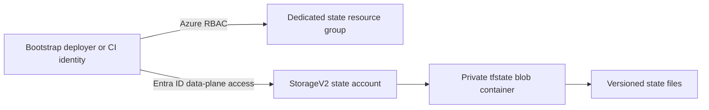

# Terraform state bootstrap

This Terraform root creates the isolated Azure infrastructure that will store remote state for the Azure Edge Platform. It is the only bootstrap scope in this milestone: it does not create Front Door, origin storage, networking, monitoring, Key Vault, or any other workload resource.

## Architecture

### Decisions

- **Dedicated resource group and storage account:** Terraform state is sensitive operational data and must not share the future workload-origin storage account. Independent ownership and lifecycle reduce the blast radius of workload changes.
- **StorageV2 with Azure AD data-plane access:** Shared-key access and local users are disabled. The AzureRM provider uses the authenticated Microsoft Entra ID principal, and the configured principals receive only `Storage Blob Data Contributor` at the state-account scope.
- **Private container, HTTPS, and TLS 1.2:** State cannot be anonymously accessed, transit is encrypted, and storage will reject non-TLS-1.2 connections.
- **Versioning and soft delete:** State versions and deleted blobs/containers remain recoverable. A lifecycle management policy removes only noncurrent blob versions after the configured retention period; it never targets the active state object.
- **Network deny by default:** The account permits data-plane access only from explicitly approved IPv4 CIDRs, plus Azure trusted services. Use controlled egress or a self-hosted runner for CI; GitHub-hosted runner IP ranges are not a stable production allow-list.
- **Intentional state migration:** The bootstrap starts locally because its backend does not exist before its first apply. After creation, the local state is migrated to the hardened account through Azure AD authentication.

## Prerequisites

- Terraform 1.9 or later and AzureRM provider 4.81.0.
- Azure CLI authentication locally, or an OIDC-enabled CI identity.
- The bootstrap execution principal must be able to create the resource group and storage account, assign `Storage Blob Data Contributor` at the state-account scope, and access the approved IP range. `Owner`, `User Access Administrator`, or a narrowly delegated equivalent is required for the role assignments.
- Resource providers required by AzureRM must already be registered in the target subscription, consistent with organization policy.

## Deployment

1. Copy `terraform.tfvars.example` to `terraform.tfvars`; replace every sample value with approved values. The real tfvars file is ignored by Git.
2. Set `allowed_ip_ranges` to the trusted public egress address of the bootstrap machine or self-hosted runner. Do not use the documentation address in the example.
3. Run `terraform init`, `terraform fmt -check`, `terraform validate`, and `terraform plan` from this directory.
4. Review the plan and run `terraform apply`. This first apply uses local state.
5. Copy `backend.hcl.example` to a local `backend.hcl`, replace the storage account name, uncomment the `terraform` backend block in `backend.tf`, then run `terraform init -migrate-state -backend-config=backend.hcl`.
6. Confirm `terraform state list` succeeds after migration, then securely remove any local state artifacts created during the bootstrap process.

`backend.hcl` is ignored by Git. Keep it in an approved secure location and do not add tenant-specific backend configuration to source control.

## Inputs

| Name | Type | Required | Default | Description |
| --- | --- | --- | --- | --- |
| `resource_group_name` | `string` | Yes | n/a | Dedicated state resource group name. |
| `location` | `string` | No | `eastus2` | Azure region for the state infrastructure. |
| `storage_account_name` | `string` | Yes | n/a | Globally unique state storage account name. |
| `state_container_name` | `string` | No | `tfstate` | Private state container name. |
| `state_access_principal_ids` | `set(string)` | Yes | n/a | Entra object IDs that need state data-plane access. |
| `allowed_ip_ranges` | `set(string)` | Yes | n/a | Trusted IPv4 CIDRs for storage data-plane access. |
| `account_replication_type` | `string` | No | `ZRS` | Storage replication strategy. |
| `blob_soft_delete_retention_days` | `number` | No | `30` | Deleted blob recovery period. |
| `container_soft_delete_retention_days` | `number` | No | `30` | Deleted container recovery period. |
| `previous_version_retention_days` | `number` | No | `365` | Retention period for noncurrent versions. |
| `tags` | `map(string)` | No | `{}` | Additional resource tags. |

## Outputs

| Name | Description |
| --- | --- |
| `resource_group_id` | Resource ID of the state resource group. |
| `storage_account_id` | Resource ID of the state storage account. |
| `storage_account_name` | State storage account name. |
| `state_container_name` | Private state container name. |
| `primary_blob_endpoint` | State storage blob endpoint. |
| `backend_configuration` | Non-secret AzureRM backend values for environment roots. |

## Operational considerations

- The storage account has `prevent_destroy` enabled. Removing it requires an explicit, reviewed lifecycle change before any destructive operation.
- Keep bootstrap access principals to a minimum. Add a separate OIDC deployment identity before enabling CI rather than using personal identities for ongoing operations.
- Review the noncurrent-version retention period against recovery requirements and storage cost. State files are usually small, so a year is a conservative default.
- Network controls will need a private endpoint and private DNS design if deployment moves entirely to private runners. That networking is intentionally out of scope for this bootstrap-only milestone.
