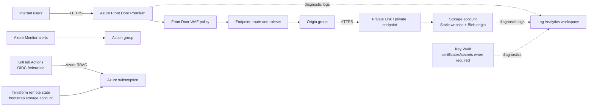
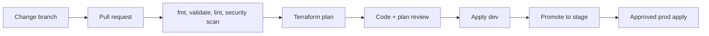

# Azure Edge Platform - Architecture Decision Record

**Status:** Proposed  
**Scope:** Phase 0 - design only; no Terraform resources are created by this document.

## 1. Purpose and goals

This project is an open-source, production-oriented Azure infrastructure repository for globally delivering static web assets. It demonstrates the engineering decisions, operational controls, and Terraform structure expected of a platform team, not a certification lab.

The platform will:

- Deliver public static content globally through Azure Front Door Standard/Premium.
- Store origin assets in Azure Blob Storage with static website hosting.
- Protect the origin from unnecessary public exposure and enforce HTTPS.
- Use Azure RBAC and managed identities rather than long-lived application secrets where Azure supports it.
- Export resource diagnostics to a central Log Analytics workspace.
- Support isolated `dev`, `stage`, and `prod` deployments from the same reusable modules.
- Be operated through pull-request-based GitHub Actions workflows with controlled production apply.

Non-goals for the initial platform are application deployment tooling, dynamic compute workloads, multi-region active/active origin replication, and a custom DNS registrar integration. These can be added after the edge delivery baseline is stable.

## 2. Target architecture



### Traffic path

1. A client resolves the Front Door endpoint or a mapped custom domain.
2. Azure Front Door terminates TLS, applies the WAF policy, and evaluates route/rule-set logic such as redirects and cache controls.
3. The Front Door origin group reaches the storage origin over HTTPS. Production uses Front Door Premium Private Link so the storage origin is not generally reachable from the internet.
4. Storage serves static website files or approved blob content. Azure Monitor captures operational and security-relevant telemetry.

### Service selection

| Capability | Azure service | Decision rationale |
| --- | --- | --- |
| Global edge delivery | Azure Front Door Premium | Provides global anycast delivery, WAF, managed certificates, rules engine, and Private Link to Azure origins. Standard is allowed for lower-cost non-production environments where private origin access is not required. |
| Static origin | Azure Storage Account, StorageV2 | Durable, low-operational-overhead object storage with static website support, encryption at rest, lifecycle policy support, and private endpoint compatibility. |
| Origin protection | Private Endpoint / Front Door Private Link | Keeps the production origin off broad public network paths. This is preferred over relying only on obscurity or IP allow lists. |
| Secret and certificate storage | Azure Key Vault | Used only when a platform-managed secret or customer-managed certificate is needed. Managed Front Door certificates remain the preferred default for custom domains. |
| Monitoring | Log Analytics + Azure Monitor | Centralizes diagnostics, alert queries, retention, and operational dashboards. |
| Access control | Azure RBAC + managed identities/OIDC | Avoids static cloud credentials. GitHub Actions authenticates with workload identity federation. |

## 3. Key architecture decisions

### Front Door tier

Production uses Front Door Premium. Its Private Link capability is the decisive control for a private storage origin. Development and stage may use Premium too for fidelity; Standard is acceptable only when cost reduction outweighs the loss of private-origin validation.

### Storage origin model

The storage account retains public network access only where required by the chosen Front Door private-origin pattern and is narrowed with resource-specific firewall/private-endpoint configuration. Anonymous blob access is disabled. Static website access is exposed only through Front Door; direct origin URLs are not treated as supported public endpoints.

An important implementation detail: Azure Storage static website hosting uses the `$web` container and the web endpoint. During Phase 4, we will validate the Azure Front Door Private Link target/subresource combination supported by the provider and service. If the static website endpoint cannot meet the private-origin requirement cleanly, the production origin will instead be an approved blob/origin service configuration behind Front Door, with the public website behavior preserved at the edge. This decision prevents an attractive diagram from becoming an unworkable deployment.

### State isolation and bootstrap

Terraform state is operationally sensitive and must not share the workload storage account. A small, separately managed bootstrap state storage account will contain state for each environment in distinct containers or keys. It will have versioning, soft delete, HTTPS-only access, Azure AD authorization, restricted network access, and a management lock where appropriate.

The backend cannot create itself. The repository will therefore include a documented, tightly scoped bootstrap workflow that provisions the state resource group, state storage, and RBAC before normal environment deployments. Bootstrap remains deliberately small and separately reviewed.

### Identity and CI/CD

GitHub Actions uses OpenID Connect workload identity federation to authenticate to Azure. Separate user-assigned identities (or app registrations, where organizational constraints require them) are assigned least-privilege RBAC per environment. No client secrets are stored in GitHub.

Pull requests run formatting, validation, static analysis, and a non-destructive plan. Applies run only from protected environment branches after GitHub Environment approval; production requires an explicit approval gate.

### Observability baseline

Each supported resource sends platform diagnostics to the environment Log Analytics workspace. Alerting is based on actionable signals: Front Door WAF blocks/anomalies, origin health failures, elevated 4xx/5xx responses, storage availability/capacity concerns, and failed deployment activity. Retention is parameterized by environment and compliance requirement.

## 4. Environment model

Each environment is an independent deployment boundary with distinct state, resource groups, identity assignments, and optionally distinct subscriptions.

| Environment | Purpose | Subscription strategy | Edge tier | Apply control |
| --- | --- | --- | --- | --- |
| `dev` | Integration and engineer validation | Non-production subscription | Premium preferred; Standard permitted | Protected branch / designated maintainers |
| `stage` | Production-like release validation | Non-production subscription, isolated from dev | Premium | GitHub Environment approval |
| `prod` | Customer-facing delivery | Dedicated production subscription | Premium | GitHub Environment approval plus protected branch |

Subscription-per-environment is preferred where the tenant and budget allow it. Separate resource groups alone are a weaker isolation boundary and should not be the sole production safeguard.

## 5. Naming, tags, and location

Names are deterministic, lowercase where Azure requires it, and include workload, environment, and region only when the resource name benefits from it.

| Resource | Pattern | Example |
| --- | --- | --- |
| Resource group | `rg-<workload>-<environment>` | `rg-edge-dev` |
| Storage account | `st<workload><environment><suffix>` | `stedgeassetsdev01` |
| Front Door profile | `afd-<workload>-<environment>` | `afd-edge-dev` |
| Key Vault | `kv-<workload>-<environment>-<suffix>` | `kv-edge-dev-01` |
| Log Analytics workspace | `law-<workload>-<environment>` | `law-edge-dev` |
| Managed identity | `id-<workload>-<environment>-deploy` | `id-edge-prod-deploy` |

`suffix` is a short, deterministic value to satisfy Azure global-name uniqueness. It is supplied once per environment rather than randomly regenerated.

All resources receive standard tags: `environment`, `workload`, `managed_by = terraform`, `repository`, `owner`, `cost_center`, `data_classification`, and `criticality`. Tags are defined centrally in each environment root and merged with module-specific tags.

The initial Azure region is parameterized, with `eastus2` recommended for the management plane unless organizational policy specifies another approved region. Front Door is global; storage, Key Vault, and Log Analytics remain regional.

## 6. Terraform repository and module boundaries

The repository separates reusable Azure service modules from environment composition. Environment roots contain policy choices and values; modules contain resource implementation and safe defaults.

```text
terraform-azure-edge-platform/
|-- modules/
|   |-- resource-group/
|   |-- storage-origin/
|   |-- network-private-endpoint/
|   |-- front-door/
|   |-- waf-policy/
|   |-- log-analytics/
|   |-- monitoring/
|   |-- key-vault/
|   `-- rbac/
|-- environments/
|   |-- dev/
|   |-- stage/
|   `-- prod/
|-- bootstrap/
|   `-- state/
|-- docs/
|   |-- architecture.md
|   |-- security-decisions.md
|   |-- operations-runbook.md
|   `-- cost-considerations.md
|-- diagrams/
|-- scripts/
`-- .github/workflows/
```

Module responsibilities:

| Module | Owns | Does not own |
| --- | --- | --- |
| `resource-group` | Resource group, standardized tags, optional lock | Workload resources |
| `storage-origin` | Storage account hardening, static website/blob settings, lifecycle rules, diagnostics hooks | VNet and private endpoint |
| `network-private-endpoint` | VNet/subnet attachment, private endpoint, private DNS integration | Storage account configuration |
| `front-door` | Profile, endpoint, origin groups, origins, routes, rule sets, custom-domain association | WAF policy definition |
| `waf-policy` | Managed/custom WAF rules, policy mode, diagnostics hooks | Front Door routes |
| `log-analytics` | Workspace and retention configuration | Alert rules |
| `monitoring` | Diagnostic settings and alert rules/action groups | Resource creation |
| `key-vault` | Vault configuration, RBAC mode, private networking options | Workload secret values |
| `rbac` | Role assignments for known principals/scopes | Identity creation unless explicitly required |

Modules expose stable, minimal inputs and outputs. Environment roots compose modules and pass resource IDs rather than duplicating underlying resources. Provider configuration and backend configuration remain in root modules, not reusable modules.

## 7. Deployment workflow

1. Bootstrap state infrastructure and grant scoped Azure RBAC to the deployment identity.
2. Create the repository skeleton, pin Terraform/AzureRM provider versions, and configure a separate backend for each environment.
3. Implement and test the resource-group module first.
4. Add observability foundation, storage origin, networking/private connectivity, then the Front Door and WAF edge layer.
5. Add CI checks before enabling applies. Test plans in `dev`, then promote the same reviewed change through `stage` and `prod`.
6. Publish runbooks, architecture diagrams, security decisions, and cost guidance alongside the modules.

The desired pull request flow is:



## 8. Security and operational guardrails

- Pin Terraform and provider versions; commit the dependency lock file.
- Use provider features that prohibit unsafe destroy operations for critical resources where appropriate, plus resource locks for production control-plane protection.
- Do not output secrets. Mark sensitive Terraform outputs as sensitive where unavoidable.
- Configure HTTPS-only, minimum TLS 1.2 or higher, and encryption at rest for storage and Key Vault.
- Use RBAC authorization for Key Vault and storage where supported; keep role scopes as narrow as practical.
- Configure diagnostic settings close to resource creation so observability is not an afterthought.
- Use Azure Policy assignments from the organizational landing zone when available; this repository documents required policy assumptions rather than attempting to replace central governance.
- Add budgets and cost alerts in production if the subscription owner delegates that responsibility to this platform.

## 9. Delivery sequence after approval

The first implementation milestone is the `resource-group` module. It establishes the tag contract, naming inputs, outputs, and safe resource-group lifecycle conventions used by every later module. It will be accompanied by its module README, input/output tables, example environment invocation, and `terraform fmt`/`validate` checks.

Subsequent milestones follow this order: repository and backend configuration; state bootstrap/RBAC; observability foundation; storage origin; private networking; Front Door/WAF; CI/CD; operational documentation.

## 10. Open decisions to resolve before production

1. Confirm target tenant, subscription layout, approved Azure regions, and enterprise naming/tagging policy.
2. Confirm whether custom domains and customer-managed certificates are in scope. Managed Front Door certificates are preferred otherwise.
3. Validate the exact private-origin design for static website hosting against the selected AzureRM provider version and Front Door Premium support matrix during Phase 4.
4. Set Log Analytics retention, alert routing, and incident-management integration according to operational requirements.
5. Decide whether storage geo-redundancy and cross-region origin failover are justified by availability and cost objectives.
